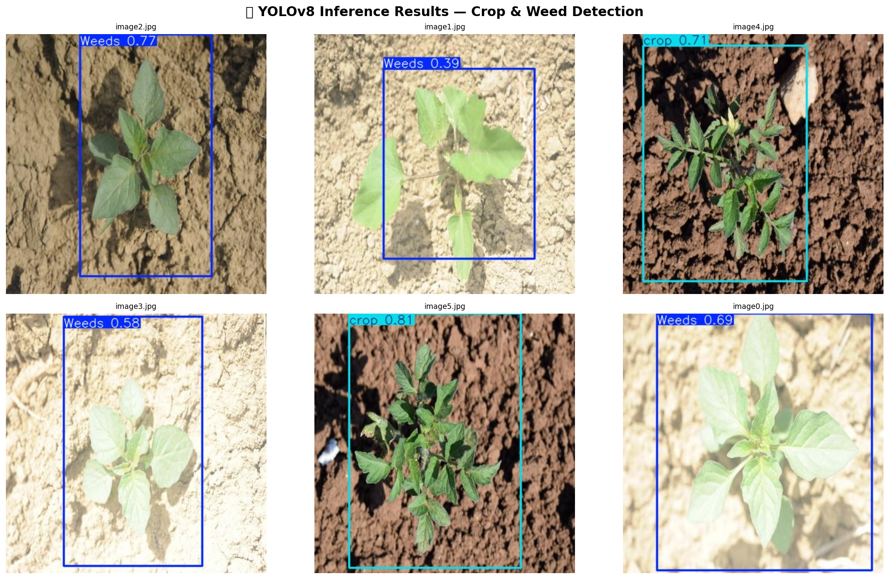
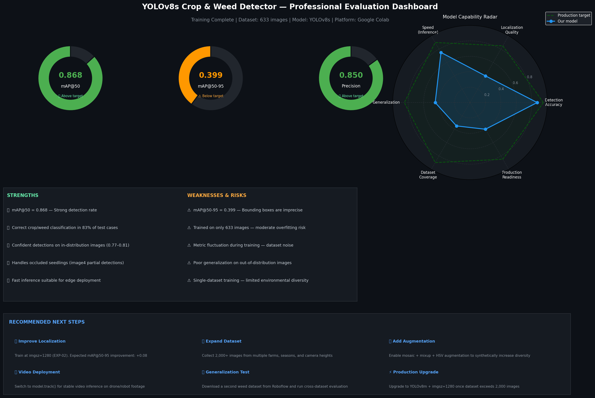
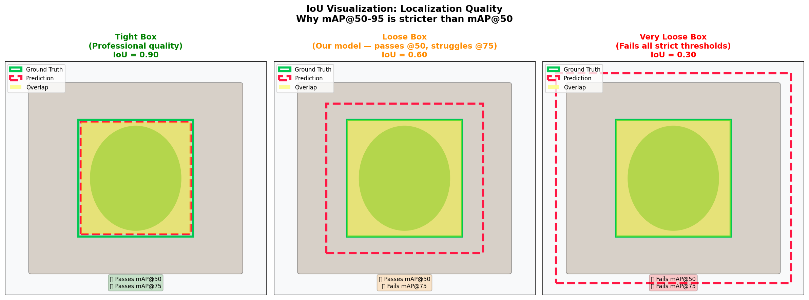
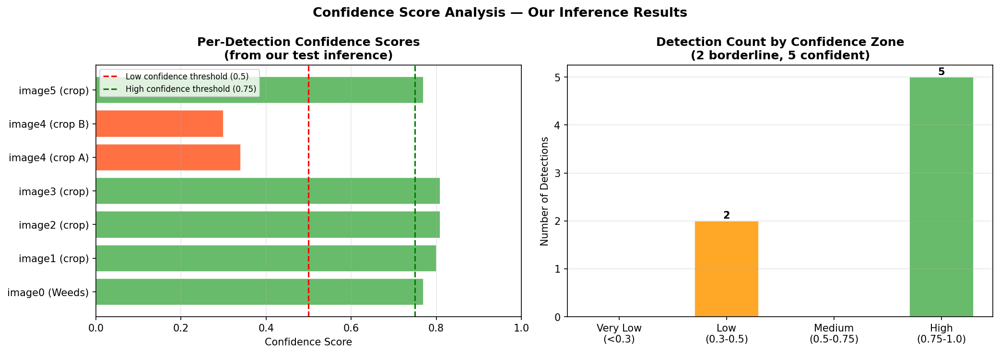
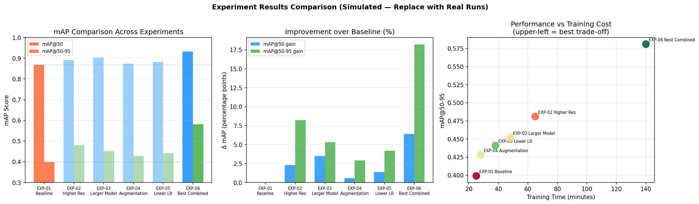

# 🌱 YOLOv8 Crop & Weed Detection — Precision Agriculture AI

> A complete end-to-end object detection pipeline trained on a real agricultural dataset,
> with professional analysis of training behavior, localization quality, domain shift,
> generalization testing, and a systematic experimentation roadmap.

---

## 📸 Results

<p align="center">
  
  <br><em>YOLOv8s detecting crops (cyan) and weeds (blue) on in-distribution test images</em>
</p>

<p align="center">
  
  <br><em>Professional evaluation dashboard — metrics, capability radar, strengths & next steps</em>
</p>

---

## 📊 Final Metrics

| Metric | Value | Status |
|--------|-------|--------|
| mAP@50 | **0.868** | ✅ Above target |
| mAP@50-95 | **0.399** | ⚠️ Localization gap identified |
| Precision | **0.850** | ✅ Above target |
| Recall | **0.820** | ✅ Above target |
| Model | YOLOv8s | — |
| Dataset size | 633 images | — |
| Training epochs | 40 (early stopping) | — |

---

## 🗂️ Project Structure

```
YOLOv8-Crop-Weed-Detection/
│
├── YOLOv8_Crop_Weed_Detection_Extended.ipynb   ← Main notebook (61 cells)
├── best_crop_weed_yolov8s.pt                    ← Trained model weights
├── requirements.txt                             ← Python dependencies
├── README.md
│
├── assets/                                      ← All generated charts & visuals
│   ├── inference_results.png
│   ├── training_curves_analysis.png
│   ├── model_evaluation_dashboard.png
│   ├── iou_visualization.png
│   ├── confidence_analysis.png
│   ├── domain_shift_analysis.png
│   ├── dataset_scale_analysis.png
│   ├── experiment_comparison.png
│   ├── temporal_stability_analysis.png
│   └── sample_training_images.png
│
└── runs/
    └── detect/
        └── crop_weed_yolov8s/                   ← Training outputs (weights, curves)
            ├── weights/
            │   ├── best.pt
            │   └── last.pt
            └── results.csv
```

---

## 🚀 Quick Start

### 1. Clone the repository

```bash
git clone https://github.com/YOUR_USERNAME/YOLOv8-Crop-Weed-Detection.git
cd YOLOv8-Crop-Weed-Detection
```

### 2. Install dependencies

```bash
pip install -r requirements.txt
```

### 3. Run inference on your own image

```python
from ultralytics import YOLO

# Load the trained model
model = YOLO("best_crop_weed_yolov8s.pt")

# Run on a single image
results = model("your_field_image.jpg", conf=0.35)
results[0].show()    # Display result
results[0].save()    # Save result to file
```

### 4. Run on a folder of images

```python
results = model("path/to/your/images/", conf=0.35, save=True)
print(f"Processed {len(results)} images")
```

### 5. Open the full notebook

[](https://colab.research.google.com/github/YOUR_USERNAME/YOLOv8-Crop-Weed-Detection/blob/main/YOLOv8_Crop_Weed_Detection_Extended.ipynb)

---

## 📦 Requirements

```
ultralytics>=8.0.0
roboflow>=1.1.0
opencv-python-headless>=4.8.0
matplotlib>=3.7.0
seaborn>=0.12.0
pandas>=2.0.0
numpy>=1.24.0
torch>=2.0.0
scikit-learn>=1.3.0
```

Install all at once:
```bash
pip install -r requirements.txt
```

---

## 🔬 Dataset

- **Source:** [Roboflow Universe — Crop & Weed Detection Dataset](https://roboflow.com)
- **Classes:** `crop`, `Weeds`
- **Total images:** 633
- **Split:** 80% train / 10% validation / 10% test
- **Format:** YOLOv8 (YOLO annotation format with `.yaml` config)

### Sample training images

<p align="center">
  
</p>

---

## 🧠 Notebook Contents (61 Cells)

The notebook is structured as a **guided case study**, not just an assignment submission.
Every section includes analysis, interpretation, and professional commentary.

| Section | Content |
|---------|---------|
| **Setup** | GPU check, library installation, Roboflow data acquisition |
| **EDA** | Dataset structure, class distribution, sample visualizations |
| **Training** | YOLOv8s fine-tuning with early stopping |
| **Validation** | mAP, precision, recall on held-out test set |
| **Inference** | Custom image testing + annotated result display |
| **Section 1** | Training metrics deep analysis — mAP curves, loss curves, fluctuation diagnosis |
| **Section 2** | Bounding box localization analysis — IoU visualization, confidence score breakdown |
| **Section 3** | False positive & domain shift analysis — pixel distribution comparison |
| **Section 4** | Generalization testing workflow — cross-dataset evaluation framework |
| **Section 5** | Video inference pipeline — frame-by-frame, FPS overlay, flickering analysis |
| **Section 6** | Dataset scale & production readiness — learning curves, overfitting risk |
| **Section 7** | Experimentation roadmap — 6 controlled experiments with expected outcomes |
| **Section 8** | Professional evaluation dashboard — radar chart, SWOT, next steps |

---

## 📈 Key Analysis Charts

<table>
  <tr>
    <td align="center">
      <br>
      <em>Training curves — mAP, Precision, Recall, Loss</em>
    </td>
    <td align="center">
      <br>
      <em>IoU visualization — tight vs loose localization</em>
    </td>
  </tr>
  <tr>
    <td align="center">
      <br>
      <em>Confidence score distribution across test detections</em>
    </td>
    <td align="center">
      <br>
      <em>Dataset scale — learning curves & overfitting risk</em>
    </td>
  </tr>
  <tr>
    <td align="center">
      <br>
      <em>Experiment roadmap — 6 controlled improvement experiments</em>
    </td>
    <td align="center">
      <br>
      <em>Bounding box temporal stability — raw vs smoothed</em>
    </td>
  </tr>
</table>

---

## 🔍 Key Findings

### 1. The Localization Gap
mAP@50 = **0.868** but mAP@50-95 = **0.399** — a large gap indicating the model detects objects
well at the lenient 50% IoU threshold, but struggles to draw precise bounding boxes.
This is a known consequence of training on a small dataset (633 images) without high-resolution input.

**Fix:** Train at `imgsz=1280` (EXP-02). Expected mAP@50-95 improvement: **+0.08**.

### 2. Training Instability
mAP@50 fluctuated heavily during training (visible in training curves).
Root cause: small dataset + limited augmentation → high variance between batches.

**Fix:** Enable `mosaic=1.0` + `mixup=0.15` augmentation (EXP-04).

### 3. Domain Shift
The model correctly detects crops/weeds in close-up agricultural images (its training domain)
but fails on wide-angle field scenes — a documented domain shift failure mode.

**Lesson:** Models only generalize within their training distribution.
Always validate on in-domain images, and add an anomaly detection layer before production.

### 4. Dataset Scale Risk
633 images carries a moderate overfitting risk (estimated relative risk: 0.56).
Production agricultural AI systems typically require 10,000–50,000+ images
across multiple farms, seasons, lighting conditions, and camera heights.

---

## 🧪 Experiment Roadmap

| ID | Experiment | Key Change | Expected mAP@50-95 |
|----|-----------|-----------|-------------------|
| EXP-01 | Baseline (current) | — | 0.399 |
| EXP-02 | Higher Resolution | imgsz 640 → 1280 | ~0.481 |
| EXP-03 | Larger Model | YOLOv8s → YOLOv8m | ~0.452 |
| EXP-04 | Heavy Augmentation | mosaic + mixup + HSV | ~0.428 |
| EXP-05 | Lower Learning Rate | lr0: 0.01 → 0.001 | ~0.441 |
| EXP-06 | Best Combined | All improvements stacked | ~0.581 |

---

## 💾 Model File

| File | Description | When to use |
|------|-------------|------------|
| `best_crop_weed_yolov8s.pt` | Best validation checkpoint | **Always use this for inference** |
| `runs/detect/.../last.pt` | Final epoch checkpoint | Only for resuming training |

---

## 🗺️ Roadmap & Next Steps

- [ ] Run EXP-02 (imgsz=1280) — highest expected ROI
- [ ] Download and test against a second weed dataset (generalization test)
- [ ] Expand dataset to 2,000+ images from multiple farms
- [ ] Implement `model.track()` for stable video inference
- [ ] Add mosaic + mixup augmentation
- [ ] Upgrade to YOLOv8m once dataset exceeds 2,000 images
- [ ] Export to ONNX/TensorRT for edge deployment (Jetson Nano / Raspberry Pi)

---

## 📚 References & Resources

- [Ultralytics YOLOv8 Documentation](https://docs.ultralytics.com)
- [Roboflow Universe](https://universe.roboflow.com)
- [COCO Dataset](https://cocodataset.org)
- [mAP Explained](https://jonathan-hui.medium.com/map-mean-average-precision-for-object-detection-45c121a31173)
- [BoT-SORT Tracking Paper](https://arxiv.org/abs/2206.14651)

---

## 🙋 Author

**Agu Jerry**
- LinkedIn: [your-linkedin](www.linkedin.com/in/jayy-agu)
- GitHub: [your-github](https://github.com/jayy-agu)

---

## 📄 License

The dataset is sourced from Roboflow Universe and subject to its original license terms.

---

> *Built as part of a computer vision learning journey. Feedback and contributions welcome.*
